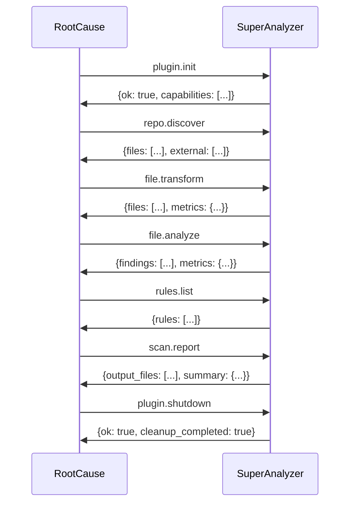

# SuperAnalyzer Plugin - Complete Example

## Overview

SuperAnalyzer is a fictional plugin that demonstrates all available capabilities in RootCause. This plugin combines file discovery, content transformation, security analysis, dynamic rule generation, and custom reporting.

## Plugin Configuration

### Manifest

The `plugin.toml` file defines the plugin's capabilities and configuration:
```toml
name = "super-analyzer"
version = "2.1.0"
api_version = "1.0.0"
entry = "python3 plugin.py"
capabilities = ["discover", "transform", "analyze", "report", "rules"]
concurrency = "parallel"
timeout_ms = 60000
mem_mb = 512
reads_fs = true
needs_content = true
config_schema = "schema.json"

[install]
steps = [
  "pip install -r requirements.txt",
  "chmod +x plugin.py"
]
```

### Configuration Schema

The `schema.json` file validates plugin options:
```json
{
  "$schema": "http://json-schema.org/draft-07/schema#",
  "type": "object",
  "properties": {
    "scan_modes": {
      "type": "array",
      "items": {
        "type": "string",
        "enum": ["aggressive", "normal", "conservative"]
      },
      "default": ["normal"]
    },
    "file_patterns": {
      "type": "array",
      "items": {"type": "string"},
      "default": ["*.js", "*.py", "*.java", "*.go"]
    },
    "report_format": {
      "type": "string",
      "enum": ["pdf", "html", "json"],
      "default": "pdf"
    },
    "exclude_paths": {
      "type": "array",
      "items": {"type": "string"},
      "default": ["node_modules", ".git", "vendor"]
    },
    "severity_threshold": {
      "type": "string",
      "enum": ["low", "medium", "high", "critical"],
      "default": "medium"
    }
  },
  "additionalProperties": false
}
```

## Implemented Capabilities

This plugin implements all five available capabilities:

- **discover**: Locates files of interest and external libraries
- **transform**: Decodes base64 content, deobfuscates JavaScript code
- **analyze**: Detects security vulnerabilities and suspicious patterns  
- **report**: Generates PDF reports with metrics and charts
- **rules**: Provides dynamic rules based on project context

## JSON-RPC Protocol

The plugin communicates with RootCause using JSON-RPC 2.0 over stdin/stdout. All messages follow the standard format with `jsonrpc: "2.0"`, `id`, and either `method` or `result`/`error`.

### Supported Methods

| Method | Capability | Description |
|--------|------------|-------------|
| `plugin.init` | All | Plugin initialization |
| `plugin.ping` | All | Health check |
| `plugin.shutdown` | All | Graceful shutdown |
| `repo.discover` | discover | File discovery |
| `file.transform` | transform | Content transformation |
| `file.analyze` | analyze | File analysis |
| `scan.report` | report | Report generation |
| `rules.list` | rules | List available rules |
| `rules.get` | rules | Get specific rule |
| `plugin.log` | All | Send logs (plugin→host) |

## Typical Workflow

SuperAnalyzer follows this sequence during a complete analysis:



## Data Structures

### FileSpec (Based on protocol.rs)
```rust
struct FileSpec {
    path: String,
    sha256: Option<String>,
    language: Option<String>,
    content_b64: Option<String>,
    size: Option<u64>,
}
```

> **Virtual paths**: When a plugin declares `reads_fs = false`, RootCause masks the
> original filesystem paths to avoid leaking workspace structure. Each file path
> is rewritten to `/virtual/<file>-<hash>`, where `<file>` is the original file
> name and `<hash>` is a stable identifier derived from the normalized path.
> Identical files keep the same virtual path across requests, while files with
> the same name in different directories receive distinct identifiers.

### PluginInit (Based on protocol.rs)
```rust
struct PluginInit {
    api_version: String,
    session_id: String,
    workspace_root: String,
    rules_root: String,
    cwd: String,
    capabilities_requested: Vec<String>,
    options: Value,
    limits: Option<Limits>,
    env: HashMap<String, String>,
}
```

### Limits (Based on protocol.rs)
```rust
struct Limits {
    cpu_ms: Option<u64>,
    mem_mb: Option<u64>,
}
```

## Standard Error Codes

The plugin uses standard JSON-RPC error codes:

- `1000`: Internal plugin error
- `1001`: Invalid configuration
- `1002`: Unknown method
- `1003`: Invalid parameters
- `1004`: Resource limit exceeded
- `1005`: File access error

## Implementation Considerations

1. **Signal Handling**: Plugin must handle `SIGTERM`, `SIGINT`, and `SIGPIPE` correctly
2. **Resource Limits**: Respect CPU and memory limits specified in `plugin.init`
3. **Logging**: Use `plugin.log` for diagnostics, never write directly to stdout
4. **Encoding**: All file content is transferred in base64 when needed
5. **Timeouts**: Plugin must respond within the specified time limit

## Capability Details

### discover
- **Purpose**: Locate files relevant for analysis
- **Input**: Base paths, extensions, filters
- **Output**: List of files with metadata

### transform  
- **Purpose**: Modify/decode files before analysis
- **Input**: Files with base64 content
- **Output**: Transformed files with applied actions

### analyze
- **Purpose**: Execute custom security analysis
- **Input**: Files to analyze
- **Output**: Findings with severity and evidence

### report
- **Purpose**: Generate custom reports
- **Input**: Findings and analysis metadata
- **Output**: Generated report files

### rules
- **Purpose**: Provide dynamic rules
- **Input**: Language/category filters
- **Output**: YAML/Semgrep rule definitions

For detailed JSON-RPC message examples, see the [`messages/`](messages/) directory.
