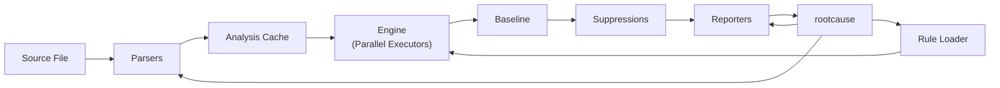

# Architecture Overview

The `rootcause` tool coordinates the analysis: loads rules, invokes parsers and the engine, applies baseline and suppressions, and finally uses reporters to produce the result.

## Data Flow

1. **Source File**: rootcause traverses project files.
2. **Parsers**: each file is transformed into `FileIR` (and optionally AST).
3. **Rule Loader**: rules are converted into `CompiledRule`.
4. **Engine**: combines `FileIR` and `CompiledRule` to generate findings.
5. **Reporters**: format findings into text, JSON or SARIF.
6. **rootcause**: displays or saves the final report.

## Parallel Executors

The engine distributes file and rule analysis through `rayon`, leveraging multiple cores to improve performance. Parallel executors balance the load and respect configured time limits. See the [Engine section](../crates/engine.md) for more details on its implementation.

## Analysis Cache

To avoid recalculating unchanged files, the engine maintains a cache based on content and rule hashes. When any of these elements changes, the corresponding entry is invalidated and re-analyzed. Cache logic is available through `analyze_files_cached`; see the [Engine section](../crates/engine.md).

## Baseline and Suppressions

The pipeline supports a *baseline* file that omits known findings and suppression comments (`// sast-ignore`) that exclude specific cases. `rootcause` exposes options to load these references and the engine applies them before sending results to reporters. For more details on available options, review the [rootcause section](../crates/rootcause.md).

---

For a detailed description of options and APIs, consult the [rootcause](../crates/rootcause.md) and [Engine](../crates/engine.md) sections.
