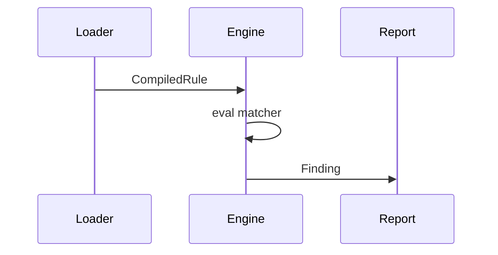

# Low Level Design

This document delves into the internal structures that the engine uses during rule evaluation.

## `CompiledRule`

`CompiledRule` is the execution-ready representation that the loader produces from a source rule.

```rust
pub struct CompiledRule {
    pub id: String,
    pub severity: Severity,
    pub category: String,
    pub message: String,
    pub remediation: Option<String>,
    pub fix: Option<String>,
    pub interfile: bool,
    pub matcher: MatcherKind,
    pub sources: Vec<String>,
    pub sinks: Vec<String>,
    pub languages: Vec<String>,
}
```

**Evaluation Pseudocode**

```text
for doc in workspace:
    for rule in ruleset:
        if rule.applies_to(doc.file_type) and rule.matcher.matches(doc):
            report_finding(rule, doc)
```

**General Flow**



## `MatcherKind`

`MatcherKind` defines how a rule is evaluated on a document.

```rust
pub enum MatcherKind {
    TextRegex(Regex, String),
    TextRegexMulti { allow: Vec<Regex>, deny: Option<Regex>, inside: Vec<Regex>, not_inside: Vec<Regex> },
    JsonPathEq(String, JsonValue),
    JsonPathRegex(String, Regex),
    AstQuery(Query),
    RegoWasm { wasm_path: String, entrypoint: String },
    TaintRule {
        sources: Vec<TaintPattern>,
        sanitizers: Vec<TaintPattern>,
        reclass: Vec<TaintPattern>,
        sinks: Vec<TaintPattern>,
    },
}
```

**Pseudocode**

```text
match rule.matcher:
    TextRegex(re, scope) => search_text(re, scope)
    TextRegexMulti{allow, deny, inside, not_inside} => search_multi(...)
    JsonPathEq(path, value) => json_path_eq(path, value)
    JsonPathRegex(path, re) => json_path_regex(path, re)
    AstQuery(q) => run_ast_query(q)
    RegoWasm{wasm_path, entrypoint} => exec_wasm(wasm_path, entrypoint)
    TaintRule{sources, sanitizers, reclass, sinks} =>
        run_taint_analysis(sources, sanitizers, reclass, sinks)
```

## `TaintPattern`

`TaintPattern` describes patterns for sources or sinks in information flow rules.

```rust
pub struct TaintPattern {
    pub allow: Vec<Regex>,
    pub deny: Option<Regex>,
    pub inside: Vec<Regex>,
    pub not_inside: Vec<Regex>,
    pub focus: Option<String>,
}
```

**Check Pseudocode**

```text
fn matches_taint(pat, snippet):
    all(p.matches(snippet) for p in pat.allow)
    && !exists(p.matches(snippet) for p in pat.deny)
    && all(context_has(snippet, p) for p in pat.inside)
    && !exists(context_has(snippet, p) for p in pat.not_inside)
```
